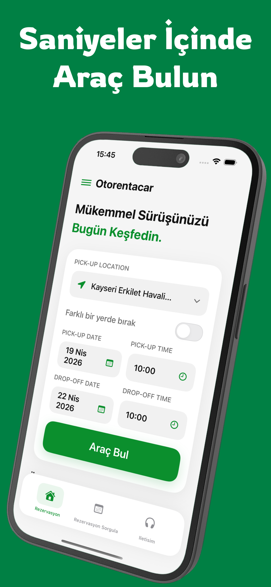
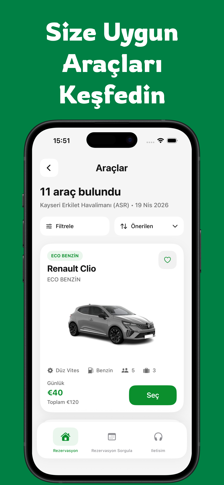
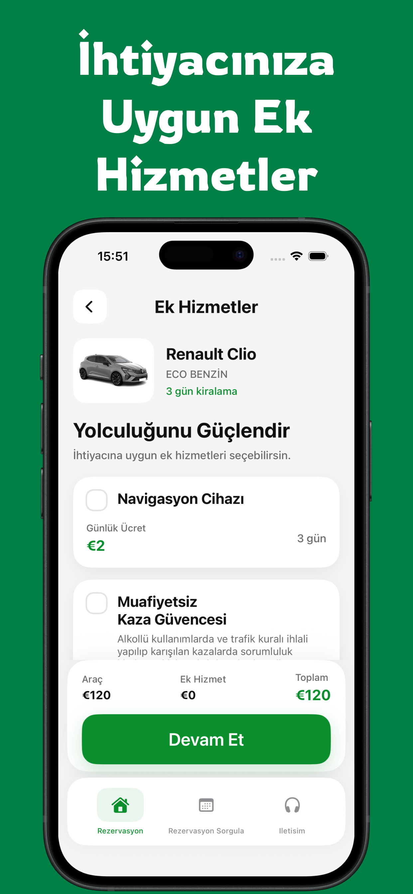
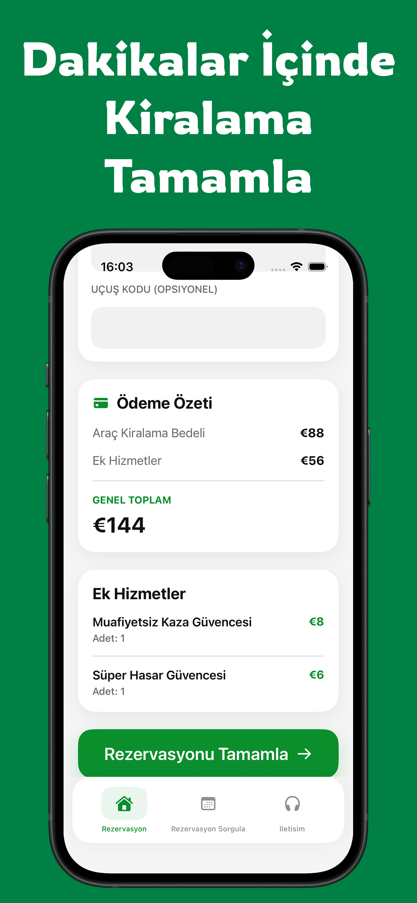
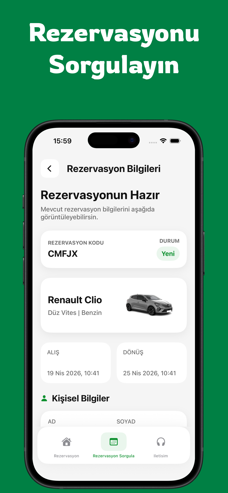

# Otorentacar – Car Rental iOS App

A modern car rental iOS application built with **SwiftUI** and **MVVM**, allowing users to search vehicles, select extras, create reservations, and query existing bookings with a tracking code.

## Preview

<p align="center">
  
  
  
  
  
</p>

---

## Features

- Search available rental vehicles by pickup/drop-off location, date, and time
- Display live vehicle data from API
- Show vehicle images dynamically from backend responses
- Select extra services such as navigation and child seat
- Handle dynamic child age inputs for child seat selection
- Calculate total rental cost accurately based on rental duration
- Create reservations with customer details
- Show reservation success screen with tracking code
- Copy reservation code easily
- Query reservations using tracking code
- Display reservation details and selected extras
- User-friendly and modern interface
- App Store ready release flow

---

## Tech Stack

- **Swift**
- **SwiftUI**
- **MVVM Architecture**
- **REST API Integration**
- **Async/Await**
- **Codable**
- **App Store Connect Deployment**

---

## Architecture

The project is structured with a clean and scalable architecture based on **MVVM**.

### Main layers

- **App**
  - App entry point
  - Routing / navigation setup

- **Core**
  - Helpers
  - Formatters
  - Session management
  - Shared utilities

- **Domain**
  - Models
  - Protocols
  - Service abstractions

- **Features**
  - Home
  - Vehicle List
  - Extras
  - Reservation Detail
  - Reservation Query
  - About / Contact

- **Resources**
  - Assets
  - LaunchScreen
  - App colors

---

## API Integrations

This application works with live backend services and includes flows such as:

- Authentication / session preparation
- Location search
- Vehicle price search
- Extra services fetch
- Reservation creation
- Reservation query

The app also handles:
- token-based requests
- dynamic form-urlencoded request bodies
- backend validation messages
- reservation tracking code retrieval

---

## Key Implementation Details

### 1. Live vehicle listing
Vehicle data is fetched dynamically from the API instead of mock data.  
The home screen and listing screen were aligned to use real backend responses.

### 2. Dynamic image loading
Vehicle images are loaded using backend-provided relative paths and converted into full image URLs for display in SwiftUI.

### 3. Reservation flow
The reservation process includes:
- customer information form
- optional flight code
- extras selection
- reservation summary
- success screen
- reservation code copy action

### 4. Extras handling
The project supports quantity-based extras and special dynamic inputs such as child age fields for child seat selection.

### 5. Reservation query flow
Users can enter a reservation code and fetch reservation details from the backend.  
Queried reservations are mapped into the app’s domain models and displayed in a dedicated detail view.

---

## Challenges Solved

During development, several real-world issues were solved:

- Correct rental day calculation based on hour difference instead of simple date difference
- Backend-compatible extras parameter formatting
- Reservation total mismatch resolution
- Dynamic child seat age input handling
- Live vehicle image integration
- Reservation query enrichment for missing visual data
- App Store submission requirements
- Privacy metadata and pricing configuration in App Store Connect

---

## Screenshots

### Home
Search for available cars by location, date, and time.

### Vehicle Listing
Browse available vehicles with live prices and backend images.

### Extras
Select additional services to customize the rental experience.

### Reservation
Complete reservation details and review total price.

### Reservation Query
Track an existing booking using reservation code.

---

## What I Learned

This project helped me improve my skills in:

- building production-style SwiftUI applications
- structuring projects with MVVM
- integrating real REST APIs
- handling backend edge cases
- designing reusable UI components
- preparing an iOS application for App Store release

---

## Future Improvements

- Favorites persistence
- Sorting and filtering improvements
- Multi-language support
- Better offline/error states
- Reservation cancellation / update support
- Unit tests for networking and view models

---

## Installation

1. Clone the repository:
   ```bash
   git clone https://github.com/your-username/otorentacarIOS.git
2. Open the project in Xcode
3. Add required API configuration values
4. Run on simulator or physical device

⸻

Notes

This project was developed as a real-world rental app experience focusing on:

* clean architecture
* live API usage
* production-like user flows
* release readiness

⸻

Author

Mustafa Ölmezses
